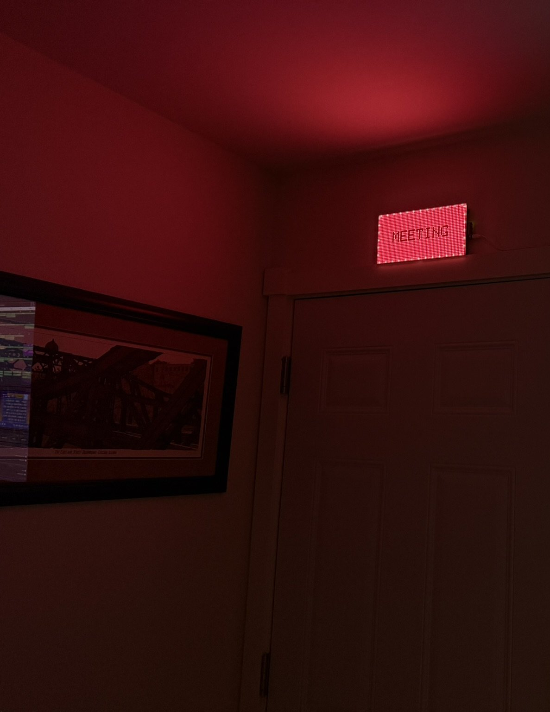
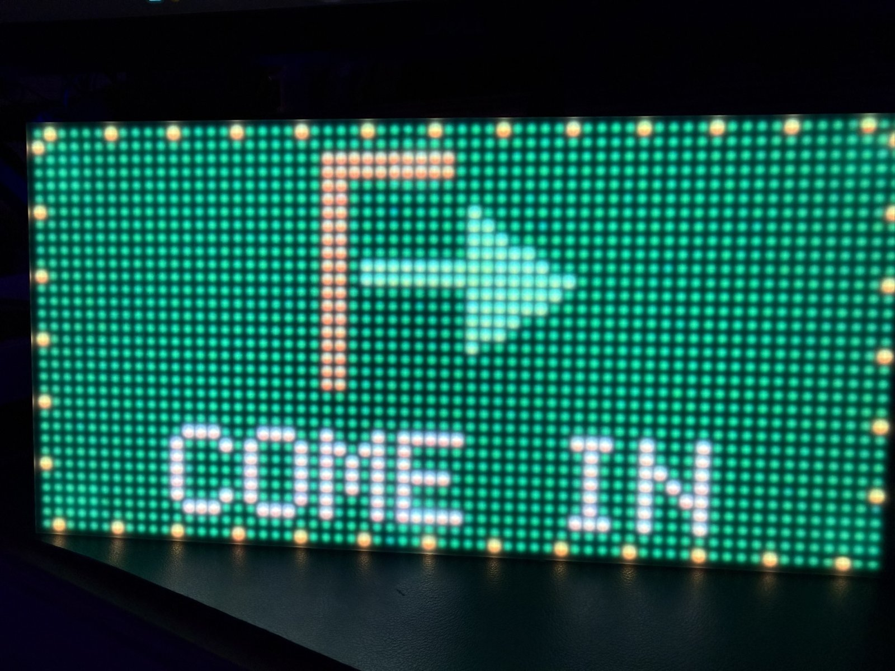
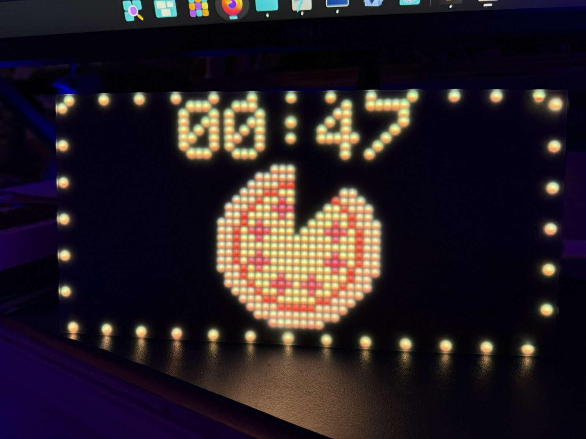
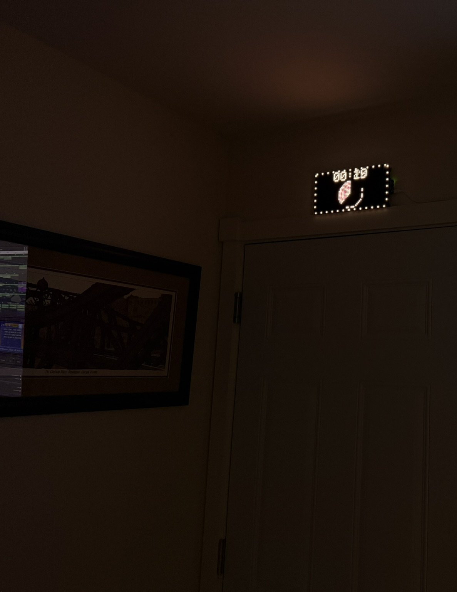

# Busy Signal — Matrix Portal M4 status board

A red/green busy/available status board for the office door, built on an
Adafruit Matrix Portal M4 + 64x32 RGB HUB75 LED matrix (same hardware as
[Rocket_Launch](https://github.com/VonHoltenCodes/Rocket_Launch)). The board
joins home WiFi via its onboard ESP32 co-processor and is controlled from a
PIN-gated page on vonholtencodes.com.

Statuses: In a Meeting, On a Call, Racing, Recording (busy/red), Working
Available, Come on In (available/green) — plus a custom scrolling message and
a countdown timer (numeric + a depleting pepperoni pizza, always shown
together). Retro on-air sign look: solid color slide alternating with an
icon+label status slide every 5s, amber bulb-dot border throughout.



| | |
|---|---|
|  |  |



## Architecture

```
Browser (anywhere, HTTPS)
  └─> vonholtencodes.com/pages/busy-signal/   (Apache+PHP on starbase1)
        auth.php   PIN gate (deploy-only, not in this repo)
        index.php  control panel UI            <- website/
        api.php    whitelisted proxy           <- website/
          └─> http://<board LAN IP>/...        (server-side, same LAN)
                └─> Matrix Portal M4 firmware  <- firmware/
```

The board's own HTTP API is plain, unauthenticated LAN HTTP — the PHP layer
on the always-on web server is the security boundary and the only public
entry point. No port needs to be open on any desktop machine.

## Layout

```
firmware/BusySignal/   Arduino sketch for the Matrix Portal M4
website/               Control panel + proxy, deployed to the web server
server/                Optional local FastAPI app (dev/testing only)
```

## Setup

### Firmware

1. arduino-cli (or Arduino IDE) with the Adafruit board index, plus
   `Adafruit Protomatter`, `Adafruit GFX Library`, and `WiFiNINA`.
   Note: upstream WiFiNINA works as-is — the matrixportal_m4 variant defines
   the NINA pins at compile time; do not call `WiFi.setPins()` (that's an
   Adafruit-fork-only API).
2. `cp firmware/BusySignal/secrets.h.example firmware/BusySignal/secrets.h`
   and fill in your WiFi SSID/password (gitignored).
3. Flash and read the IP from serial (9600 baud — the sketch prints a
   network scan and connection diagnostics at boot):
   ```
   arduino-cli compile --fqbn adafruit:samd:adafruit_matrixportal_m4 firmware/BusySignal
   arduino-cli upload -p /dev/ttyACM0 --fqbn adafruit:samd:adafruit_matrixportal_m4 firmware/BusySignal
   ```
4. Give the board a DHCP reservation so its IP can't drift.

Firmware HTTP routes: `/meeting`, `/call`, `/racing`, `/recording`,
`/working`, `/comein`, `/message?text=`, `/message/clear`,
`/timer?minutes=&attached=`, `/timer/cancel`. WiFi self-heals (reconnect
retry every 30s).

### Website

Deploy `website/*` to the gated directory on the web server and set
`BOARD_BASE` in `api.php` to the board's LAN IP. The PIN gate (`auth.php`,
bcrypt PIN hash + PHP session) and `logout.php` are deploy-only — kept out
of this repo so the hash never goes public.

### Local dev server (optional)

A standalone FastAPI equivalent of the website layer, useful when hacking on
firmware without touching production:

```
cd server
pip install -r requirements.txt
cp .env.example .env   # set BOARD_IP
uvicorn app.main:app --host 0.0.0.0 --port 3001
```

## Status

**LIVE** (2026-07-20). Firmware flashed and verified on hardware; the
website control panel drives the physical sign end-to-end over HTTPS
(PIN login → api.php → board), tested against every route. The previous
devbase1-hosted control path (systemd service + open port 3001) is
decommissioned — the unit file remains for optional local dev, disabled.
