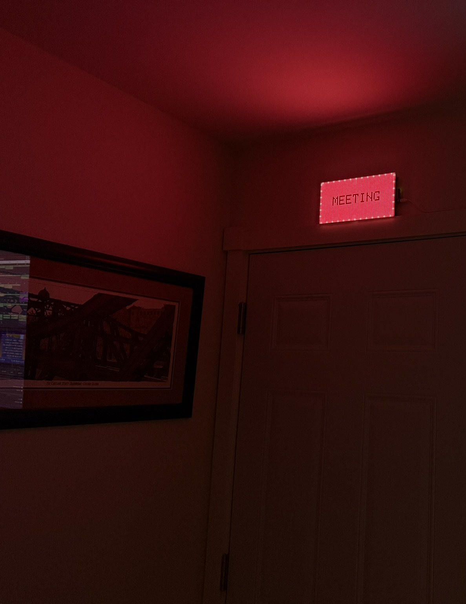
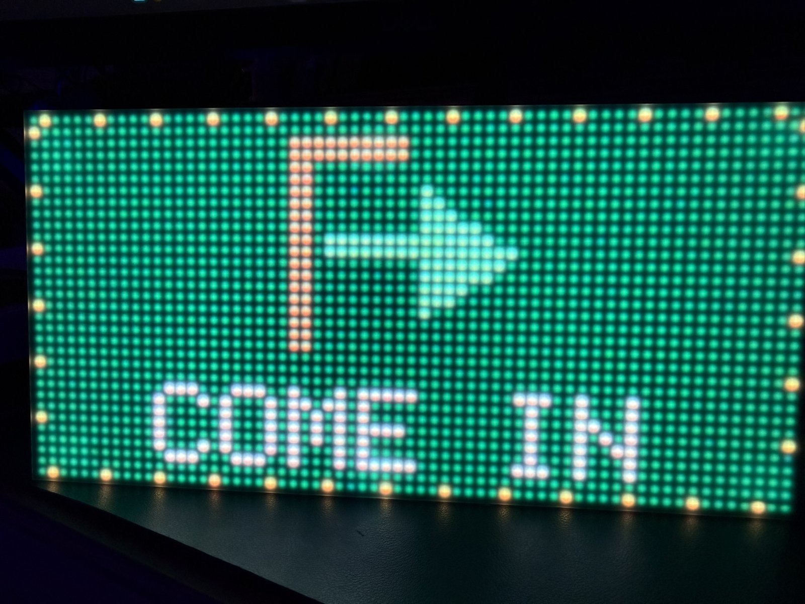
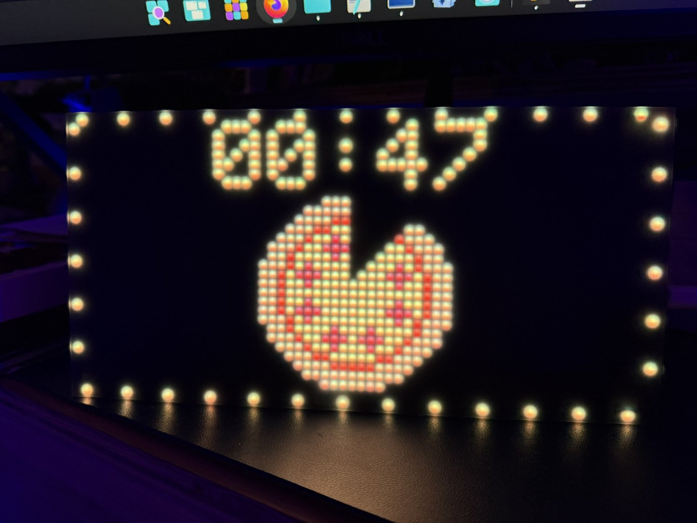
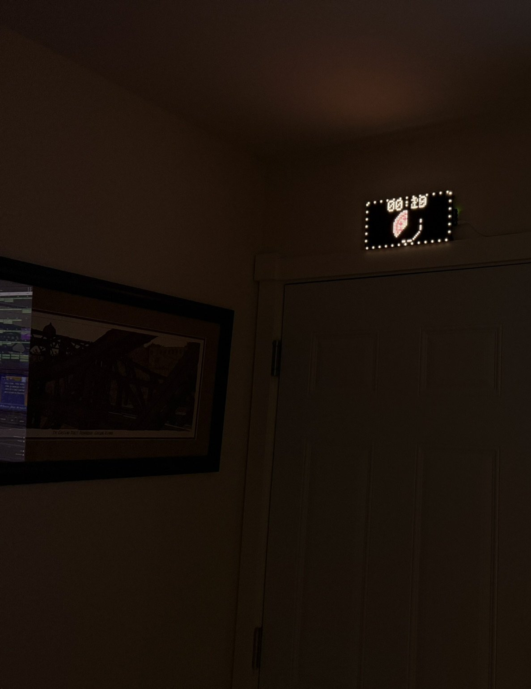

# Busy Signal — Matrix Portal M4 status board

A red/green busy/available sign built on an Adafruit Matrix Portal M4 +
64x32 RGB HUB75 LED matrix (same hardware as
[Rocket_Launch](https://github.com/VonHoltenCodes/Rocket_Launch)). The board
joins home WiFi via its onboard ESP32 co-processor and is controlled from a
PIN-gated page on vonholtencodes.com.

It has two everyday faces. The **lab sign** is the default: it hangs over
the entrance to the NEON PULSE LAB and never cuts away from the logo (see
[The lab sign](#the-lab-sign)). The **classic board** is the original
office-door status board, still one tap away.

Classic board statuses: In a Meeting, On a Call, Racing, Recording (busy/red), Working
Available, Come on In (available/green) — plus a custom scrolling message and
a countdown timer (numeric + a depleting pepperoni pizza, always shown
together). Retro on-air sign look: solid color slide alternating with an
icon+label status slide every 5s, amber bulb-dot border throughout.



| | |
|---|---|
|  |  |



Alongside the everyday faces there is a **scene engine**: full-frame
animated shows selected from the same control panel. The first set is a
Jurassic Park playlist built for Nolan's sixth birthday — the park gates
swinging open, a T-Rex roaring at sunset, Blue, Jeep 10 with something big
following it, a hatching egg, the park emblem, and a happy-birthday finale.

## Architecture

```
Browser (anywhere, HTTPS)
  └─> vonholtencodes.com/pages/busy-signal/   (Apache+PHP on the web server)
        auth.php   PIN gate (deploy-only, not in this repo)
        index.php  control panel UI            <- website/
        api.php    whitelisted proxy           <- website/
          └─> http://<board LAN IP>/...        (server-side, same LAN)
                └─> Matrix Portal M4 firmware  <- firmware/
```

The board's own HTTP API is plain, unauthenticated LAN HTTP — the PHP layer
on the always-on web server is the security boundary and the only public
entry point. No port needs to be open on any desktop machine.

## Layout

```
firmware/BusySignal/   Arduino sketch for the Matrix Portal M4
  Gfx.{h,cpp}          Software framebuffer + drawing primitives
  Lab.{h,cpp}          The NEON PULSE LAB face
  Scenes.{h,cpp}       The animated scenes
  Font5x7.h            Adafruit_GFX's glyphs, copied so the sim can match
sim/                   Headless simulator running the same lab face + scenes
  parity.sh            Diffs the simulator against the firmware's own C++
tools/flash.sh         Build and flash, over USB or over WiFi
website/               Control panel + proxy, deployed to the web server
server/                Optional local FastAPI app (dev/testing only)
```

## The lab sign

```
 (o)  NEON PULSE  (o)      cyan lockup lettering with a magenta echo
 ═════  LAB  ═════         rules in the brand's 16-band sunset ramp

   <=== jet ===~ ~ ~       the animated half
 (o)               (o)     lamps: red = busy, green = come in
```

The top half is fixed: NEON PULSE in hand-cut 7-row glyphs after the brand
lockup (square shoulders, stepped N, a one-pixel magenta echo), LAB in
magenta between two ramp-coloured rules. A lamp in each corner breathes
slowly — **red for any busy status, green for any available one**. Changing
status only recolours the lamps; nothing else on the sign moves.

The bottom half belongs to the jet, the dark delta from the NPVS wallpaper
with its cyan rim and afterburner:

- **No message** — every 9 seconds it flies in from the right, slows at
  centre for a barrel roll (it climbs over the top, inverted at the apex,
  with the exhaust trail drawing the corkscrew behind it) and carries on
  out to the left. Then the sign sits still for a few seconds.
- **Message** — it flies straight through at reading pace with the text
  riding in its wake, white-hot behind the nozzle and cooling to orange
  further back. It loops until the message is cleared.
- **Attached timer** — with no message, the countdown is what it carries.

The jet is a small 3D model rather than a sprite: wings, fin, tailplanes and
canopy are rotated about the flight axis and painted far-to-near, so the
roll shows the top of the wings, the inverted profile and the belly as it
turns. Like the scenes, the face is a pure function of elapsed seconds.

The face clock restarts whenever the cargo changes, so a new message always
flies in from the right edge. The firmware folds whole passes off that clock
about once an hour; a float of seconds that was left to grow would stop
resolving single frames after about a week and the jet would stutter.

## Scenes

A scene is a pure function of elapsed seconds drawing into a 64x32 RGB
framebuffer (`Gfx.cpp`), which is blitted to the panel once per frame. Being
pure means the board can be dropped into any scene at any moment with no
state to restore, and the simulator can scrub anywhere in the timeline.

| Route | Scene | Length |
|---|---|---|
| `/scene?name=gate` | The park gates open on a lit paddock | 9s |
| `/scene?name=welcome` | Welcome sign, typed out | 6s |
| `/scene?name=trex` | T-Rex roaring against a sunset | 9s |
| `/scene?name=jeep` | Jeep 10 on the park road, being followed | 7s |
| `/scene?name=blue` | Blue, in close-up | 7s |
| `/scene?name=egg` | An egg hatching | 8s |
| `/scene?name=logo` | The park emblem | 6s |
| `/scene?name=birthday` | Happy birthday finale | 11s |
| `/scene?name=party` | All eight on a loop | 63s |
| `/scene/stop` | Back to the sign | |

A scene holds until a status route is called or `/scene/stop` is hit, then
the sign returns to whichever face is selected. `/state` reports what is
showing (`lab:busy+message`, `scene:trex`, `status:meeting`, ...).

### Simulator

Designing pixel art by flashing the board is unworkable, so `sim/` runs the
**same source** headless. `lab` and `labmsg` are the lab face idle and
carrying a message (`LAB_MSG="..."` to change it):

```
cd sim
node render.js all 8 6              # contact sheet per scene -> /tmp/jpshots
TIMES=1.7,2.0,2.3 node render.js lab 3 14    # the roll, zoomed
node rawframes.js trex 12 /tmp/js   # unscaled frames, for parity checks
```

`sim/lab.js` / `Lab.cpp` and `sim/scenes.js` / `Scenes.cpp` are line-for-line
ports of each other and must be changed together. `sim/parity.sh` proves they
still agree: it builds the firmware's own drawing code on the PC (stub
headers in `sim/host/`), renders the same frames from both and counts the
pixels that differ.

```
./sim/parity.sh            # 48 frames of every scene and both lab passes
./sim/parity.sh 12 lab     # just the lab face
```

Across 48 frames of everything, 708 of 983,040 pixels differ. The lab face
accounts for 7 of them, each one brightness step; the rest are one-step
alpha rounding plus a few dozen isolated pixels in the Jurassic scenes.
Two gotchas that caused real divergence and will again: colour channels must
**clamp**, never mask (`0xFF &` wraps a scaled highlight into a new hue), and
a JS loop starting at a fractional coordinate must stay fractional in C++ —
an `int` loop lands on different pixel centres and shifts a whole glow.

## Setup

### Firmware

1. arduino-cli (or Arduino IDE) with the Adafruit board index, plus
   `Adafruit Protomatter`, `Adafruit GFX Library`, and `WiFiNINA`.
   Note: upstream WiFiNINA works as-is — the matrixportal_m4 variant defines
   the NINA pins at compile time; do not call `WiFi.setPins()` (that's an
   Adafruit-fork-only API).
2. `cp firmware/BusySignal/secrets.h.example firmware/BusySignal/secrets.h`
   and fill in your WiFi SSID/password (gitignored).
   Also set `OTA_PASSWORD`, which guards wireless upload.
3. Flash over USB and read the IP from serial (9600 baud — the sketch prints
   a network scan and connection diagnostics at boot):
   ```
   ./tools/flash.sh usb
   ```
4. Give the board a DHCP reservation so its IP can't drift.

Firmware HTTP routes: `/busy`, `/meeting`, `/call`, `/racing`,
`/recording`, `/working`, `/comein`, `/message?text=`, `/message/clear`,
`/face?name=lab|classic`, `/timer?minutes=&attached=`, `/timer/cancel`,
`/scene?name=`, `/scene/stop`, `/state`. WiFi self-heals (reconnect retry
backs off from 30s to 5 min).

The sign powers up on the lab face; `BOOT_MODE` near the top of
`BusySignal.ino` changes that (`DISP_PARTY` runs the birthday show with no
network at all).

### Flashing over WiFi

The firmware carries an OTA agent on port 65280, so the board only has to
come off the wall once. After the first USB flash:

```
./tools/flash.sh ota            # defaults to 192.168.68.67
./tools/flash.sh ota <board-ip>
```

The board stages the incoming image in the top half of its flash and copies
it down on reset, which caps a wirelessly-deliverable sketch at **253,952
bytes**; `flash.sh` warns if a build crosses that. The panel shows UPDATING
while the transfer runs — rendering is blocked until the board reboots.

The protocol is a plain authenticated POST, so nothing beyond curl is needed:

```
curl -u arduino:<OTA_PASSWORD> -H "Expect:" \
     --data-binary @build/BusySignal.ino.bin \
     http://<board-ip>:65280/sketch
```

### Website

Deploy `website/*` to the gated directory on the web server and set
`BOARD_BASE` in `api.php` to the board's LAN IP. The PIN gate (`auth.php`,
bcrypt PIN hash + PHP session) and `logout.php` are deploy-only — kept out
of this repo so the hash never goes public.

### Local dev server (optional)

A standalone FastAPI equivalent of the website layer, useful when hacking on
firmware without touching production:

```
cd server
pip install -r requirements.txt
cp .env.example .env   # set BOARD_IP
uvicorn app.main:app --host 0.0.0.0 --port 3001
```

## Status

**Lab sign** (2026-10-03): the NEON PULSE LAB face is flashed and verified
on the panel, every route exercised over WiFi.

**LIVE** (2026-07-20). Firmware flashed and verified on hardware; the
website control panel drives the physical sign end-to-end over HTTPS
(PIN login → api.php → board), tested against every route. The previous
devbase1-hosted control path (systemd service + open port 3001) is
decommissioned — the unit file remains for optional local dev, disabled.
